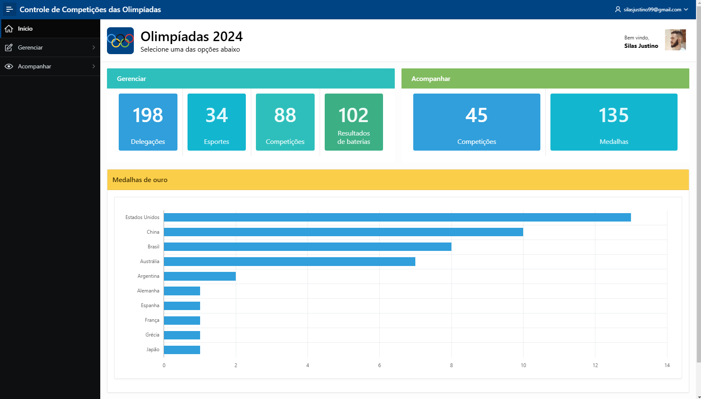

<h1 align="center"> Olimpíadas 2024 </h1>

Sistema de gerenciamento de competições olímpicas, ambientado em Paris 2024, com dados fictícios persistentes e um mecanismo de auditoria de mudanças.  

  <a href="#-tecnologias">Tecnologias</a>&nbsp;&nbsp;&nbsp;|&nbsp;&nbsp;&nbsp;
  <a href="#-funcionalidades">Funcionalidades</a>&nbsp;&nbsp;&nbsp;

 

  

## 🚀 Tecnologias

Esse projeto foi desenvolvido com as seguintes tecnologias:

- Oracle APEX
- JavaScript
- Oracle DataModeler

## 💻 Funcionalidades

✅ Login com Google, implementado via API OAuth 2.0; 
✅ Gerenciamento completo das entidades, incluindo cadastro, edição e exclusão de: 
🔹 Delegações e seus Atletas, Comissão Técnica e Jurados; 
🔹 Esportes e suas Modalidades e Categorias; 
🔹 Competições e suas Baterias e Resultados. 
✅ Acompanhamento de competições e ranking de medalhas; 
✅ Banco de dados robusto, garantindo persistência e rastreamento de alterações. 
✅ Interface responsiva, adaptada para dispositivos desktop e mobile; 

- [Acesse o projeto finalizado, online](https://apex.oracle.com/pls/apex/r/projetos_sj/controle-de-competi%C3%A7%C3%B5es-das-olimp%C3%ADadas/)
